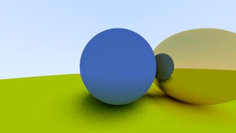
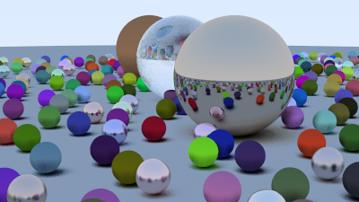

# Semaine 3

### Description du travail

#### 2h

Ajout de matériaux avec différents algorithme de réflection. Lambertian(mat) et métallique.

#### 8.25 h

Ajout de la fuzziness des objets métalliques, ajout de dielectrics (matériaux comme de la vitre ou de l'eau) et de la réfraction dans les objets. Changement de fonctionnement de la caméra pour qu'elle puisse changer de position, d'orientation et de field of view. Ajout de la profondeur de champ pour créer un effet de lentille. Création d'un render final avec les différentes sphères de matériaux différents pour observer les effets sur les rayons de couleurs.

#### 3.25h

#### 2h

#### 2h

#### ~15h

### Connaissances acquises

### Références

https://doc.rust-lang.org/stable/rust-by-example/ Rust by Example pour apprendre les fonctionnalités du langage.

https://github.com/andystanton/raytracer-rs/blob/master/src/raytracer.rs Utilisation du multithreading en Rust
